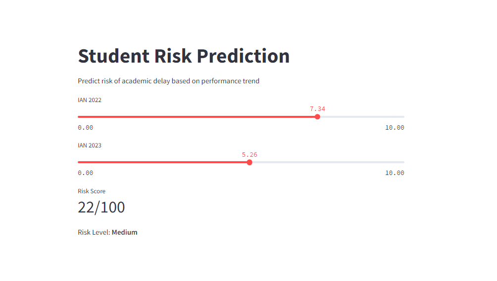
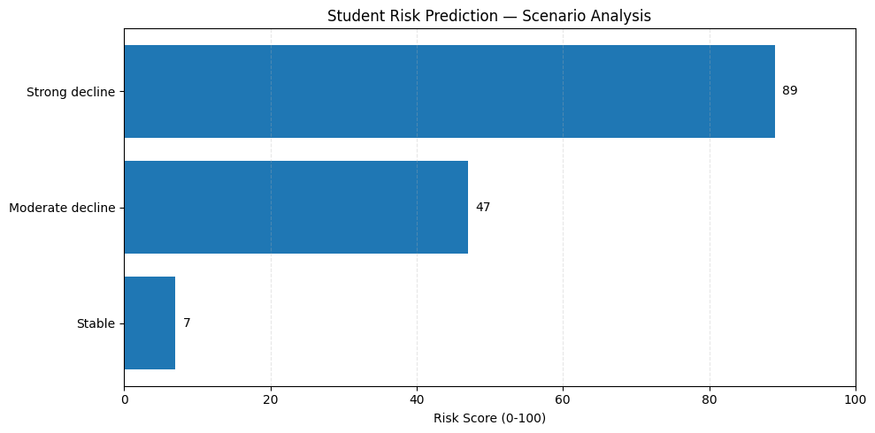

# Student Risk Prediction



Machine Learning project to predict the risk of academic delay based on students' performance evolution over time.

---

## Live Demo

https://student-risk-prediction-app.streamlit.app

---

## Objective

The goal of this project is to identify students at risk of academic delay early, using changes in performance as the main predictive signal, enabling proactive interventions.

---

## Approach

The model focuses on performance evolution, using:

* Initial score (`ian_2022`)
* Recent score (`ian_2023`)
* Absolute variation (`delta_ian`)
* Relative variation (`ratio_ian`)

All derived features are computed internally to ensure consistency and avoid user input errors.

---

## Model

* Random Forest Classifier
* Handles class imbalance
* Outputs probabilities instead of direct predictions
* Designed for robustness with limited data

---

## Model Performance

The model was optimized using threshold tuning to improve recall for at-risk students.

### Key Metrics

* Recall (class 1 – at risk): ~0.83
* Optimized threshold: 0.2
* Focus: maximize detection of high-risk students

This approach prioritizes recall over precision due to the higher cost of false negatives in this context.

---

## Visualization

Below is an example of how the model behaves based on performance variation:



---

## Project Structure

```
src/
│
├── data/
│   └── load_data.py
│
├── features/
│   ├── build_features.py
│   └── select_features.py
│
├── models/
│   ├── train.py
│   └── predict.py
│
├── utils/
│   └── config.py
│
└── __init__.py

notebooks/
│
├── 01_eda_modeling.ipynb
├── 02_inference.ipynb

models/
│
└── modelo_risco.pkl

assets/
│
└── images/
    └── grafico_modelo.png

app.py
requirements.txt
.gitignore
```

---

## How to Run the Project

### 1. Clone the repository

```bash
git clone https://github.com/your-username/student-risk-prediction.git
cd student-risk-prediction
```

### 2. Create a virtual environment

```bash
python -m venv venv
```

Activate:

**Windows**

```bash
venv\Scripts\activate
```

**Mac/Linux**

```bash
source venv/bin/activate
```

---

### 3. Install dependencies

```bash
pip install -r requirements.txt
```

---

### 4. Train the model (optional)

Using notebook:

```
notebooks/01_eda_modeling.ipynb
```

Or via script:

```bash
python src/models/train.py
```

---

### 5. Run the Streamlit app

```bash
streamlit run app.py
```

---

## Challenges

* Limited dataset size
* Difficulty in separating intermediate cases
* Sensitivity to small performance variations

---

## Mitigations

* Feature engineering
* Threshold optimization
* Evaluation focused on business impact

---

## Results and Insights

The model performs well in:

* Detecting significant performance drops (high risk)
* Identifying stable students (low risk)

---

## Limitations

* Lower performance on borderline cases
* Strong dependency on dataset size and variability

---

## Future Improvements

* Increase dataset size
* Experiment with boosting models (XGBoost, LightGBM)
* Improve probability calibration
* Incorporate longer time-series data

